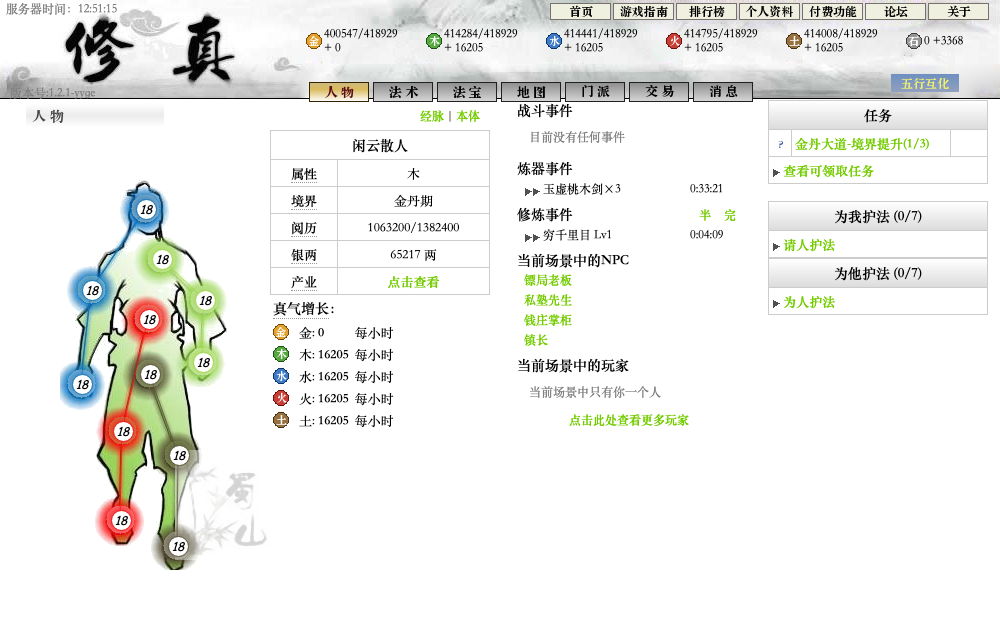
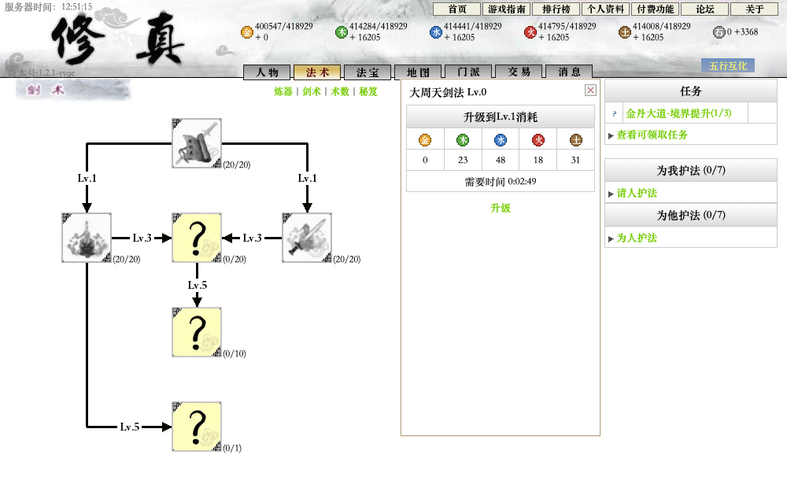
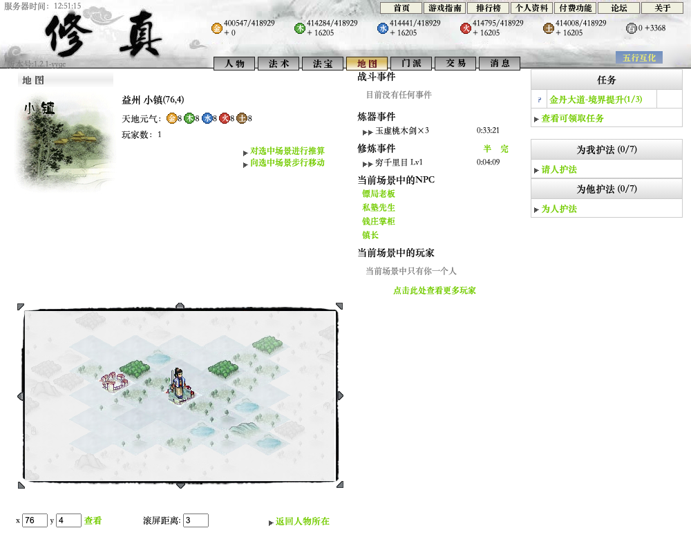
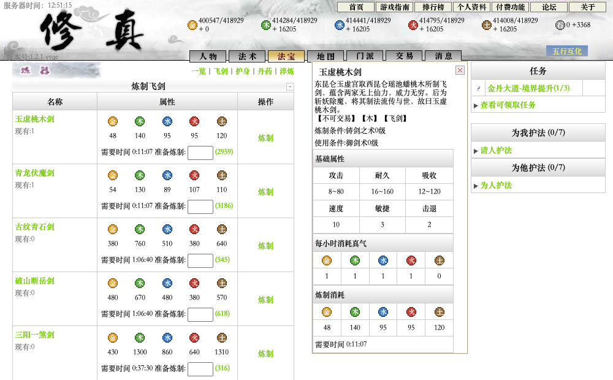

# 《修真》本地怀旧版

重回那个打开网页、挂上修炼，等一柄飞剑出炉的年代。

这是 2008 年网页游戏《修真》的本地单机复刻。保留熟悉的水墨界面、五行经脉和修行节奏，
在自己的浏览器里，从初入仙门到凝结金丹，慢慢积攒道行。



## 在这里修行

- **修经脉，习法术**：积攒五行真气，修炼经脉与本体，学习剑术、炼器和术数，完成境界任务。
- **铸飞剑，炼法宝**：炼制、淬炼、修理飞剑，搭配护身，出击斗法，查看战报。
- **游九州，访城镇**：行走或御剑穿过山川，接取任务、押镖、寻宝，与城镇人物交谈。
- **随时回来接着玩**：进度自动保存，离线期间继续结算修炼与炼器；也可调整时间倍速。

## 游戏画面

以下均为本地版本的实机截图。

### 剑术修习

从御剑术起步，逐步解锁剑诀，选择自己的修行方向。



### 九州行旅

水墨山川之间，寻找城镇与福地，沿途积累阅历。



### 炼器铸剑

从一柄玉虚桃木剑开始，查看五行消耗与法宝属性，安排炼制。



## 开始修行

安装 [Node.js 24](https://nodejs.org/)，在项目目录运行：

```bash
npm ci
npm run dev
```

打开 **[http://localhost:5273](http://localhost:5273)**，创建人物即可开始。

存档保存在当前浏览器中。顶栏「关于」可以调整倍速、导入和导出存档；换浏览器或清理浏览器数据前，记得导出备份。

## 关于这次复刻

原版由广州昆冈开发、广州游艺运营，现已停运。这个版本依据留存的截图、页面、战报和攻略重新制作，
尽量保留当年的界面与玩法。缺失的规则和数值有所重建，不能视为原版的完整复原；其他玩家的互动由本地 NPC 模拟。

本项目用于个人本地怀旧，不接入真实付费。原作名称、文案和美术归原权利人所有，感谢当年留下截图与攻略的玩家。

开发、验证和参考资料说明见 [DEVELOPMENT.md](DEVELOPMENT.md)。
